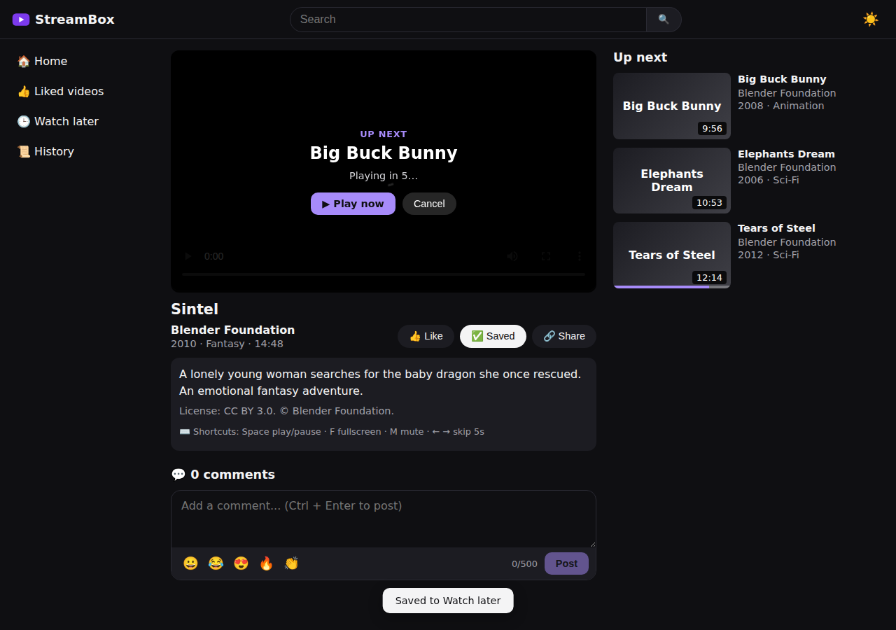
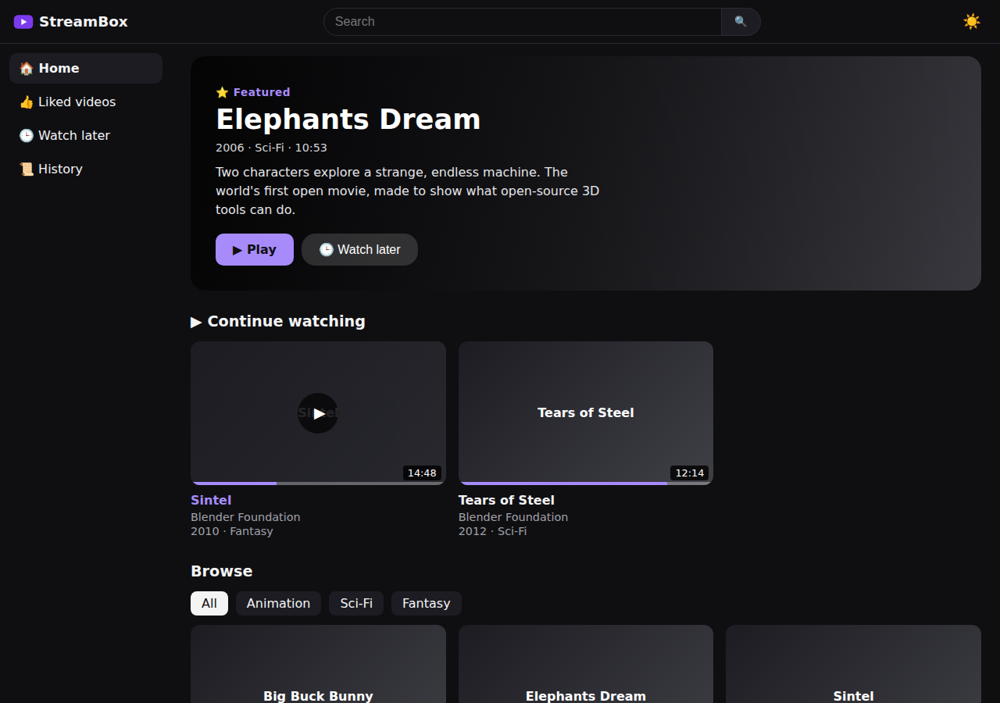
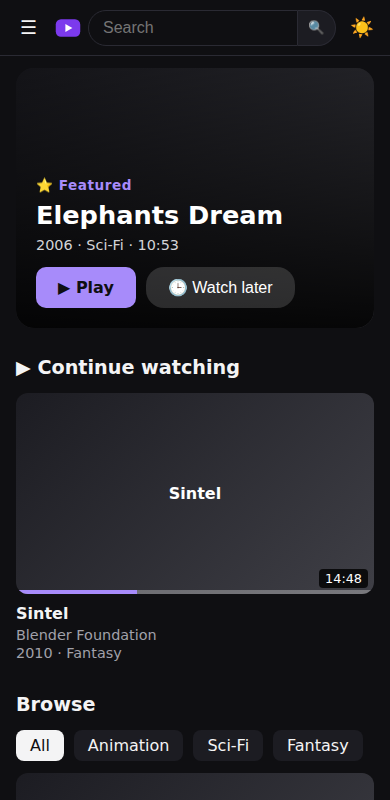

# StreamBox

A video streaming web app, inspired by YouTube, built with plain **HTML, CSS and JavaScript**. It has no frameworks, no backend and no build step.

**Live demo:** https://nitesh98.github.io/streambox/



## Features

- **Featured video** banner on the home page that changes every day
- **Continue watching** row with progress bars, and **resume** from where you stopped
- **Up next autoplay** with a 5-second countdown and a Cancel button
- **Search** and **category filters**
- **Comments** with an emoji bar, a character counter and Ctrl + Enter to post
- **Like, Watch later and History**, with toast messages confirming each action
- **Keyboard shortcuts**: Space/K play or pause, F fullscreen, M mute, ← → skip 5s, / search
- **Dark theme by default** (following streaming-app design research), with a light mode
- **Works on phones** with a slide-out menu that closes when you tap outside it
- **Accessible**: visible keyboard focus, screen-reader labels, and reduced motion respected
- **Friendly empty and error states**, e.g. when a video can't load





## Security and privacy

- **No secrets:** the app needs no API keys or passwords, so nothing sensitive is in the code.
- **XSS-safe rendering:** all text is added with `textContent`, never `innerHTML`, so user input such as a search for `<script>` is shown as text and can't run. A test checks this.
- **Content Security Policy:** the page only runs scripts from its own site.
- **Private by design:** likes, comments, history and watch progress stay in your own browser and are never sent to a server.

## Tech stack

| Area | Used |
|---|---|
| UI | HTML5, CSS (Grid, Flexbox, custom properties for theming) |
| Logic | JavaScript ES modules, hash-based router, DOM APIs |
| Storage | `localStorage` |
| Testing | Playwright browser tests |
| CI / hosting | GitHub Actions, GitHub Pages |

## Project structure

```
index.html        page layout (header, sidebar, main area)
css/style.css     all styling, light/dark themes, mobile layout
js/app.js         router and page rendering
js/videos.js      the video catalogue: add videos here
js/storage.js     likes, watch later, history, theme
tests/            automated browser test
```

## Run it locally

1. Download the code: `git clone https://github.com/nitesh98/streambox.git`
2. Open the folder in VS Code and start any local web server, for example the **Live Server** extension (right-click `index.html` → "Open with Live Server").

To run the tests:

```bash
npm install
npx playwright install chromium
npm test
```

## Video credits

All videos are open movies by the [Blender Foundation](https://studio.blender.org/films/), released under Creative Commons Attribution licenses: *Big Buck Bunny*, *Elephants Dream*, *Sintel* and *Tears of Steel*.

StreamBox is a learning project and isn't affiliated with YouTube or Google.

## Ideas for next steps

- Playlists
- Shared comments using a real database
- Rebuild in React
